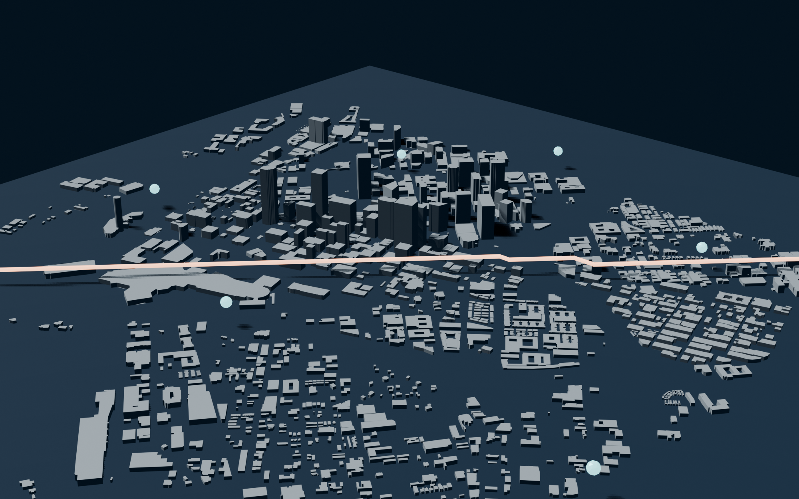
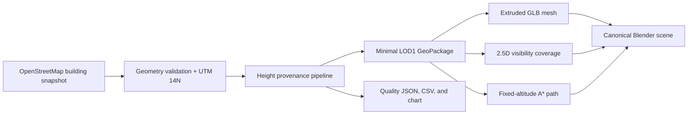
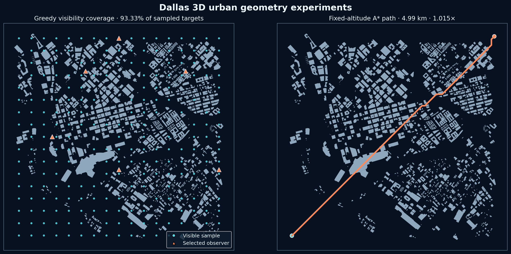

# Dallas 3D Urban Geometry Lab

> A reproducible, LOD1-style model of downtown Dallas for building-height provenance, 2.5D line-of-sight coverage, and fixed-altitude path-planning experiments.

[](https://github.com/YuvrajKashyap/dallas-3d-city-model/actions/workflows/ci.yml)
[](https://www.python.org/)
[](DATA_LICENSE.md)



*Building footprints and tags © [OpenStreetMap contributors](https://www.openstreetmap.org/copyright), available under the ODbL.*

This project turns OpenStreetMap building footprints into a traceable 3D research artifact. It replaces the original uniform and randomized-height prototype with deterministic enrichment, records the source and confidence of every height, generates an inspectable Blender scene, and runs two concrete urban-geometry experiments.

## What is here

| Artifact | Current result |
| --- | ---: |
| Building footprints | 1,553 |
| Projected study extent | 3.62 km × 3.57 km |
| Explicit or levels-derived heights | 23.37% |
| Greedy visibility coverage | 93.33% of 240 sampled targets |
| Selected observer samples | 6 of 40 candidates |
| Fixed-altitude A* route | 4.99 km |
| A* detour ratio | 1.015× straight-line distance |

These are reproducible outputs of the checked-in model configuration—not claims about real flight performance. The experiment intentionally omits terrain, vegetation, wires, weather, airspace, radio propagation, and vehicle dynamics. It is not an operational UAV planner.

## Engineering highlights

- **Traceable height enrichment.** OSM `height` values are preferred, valid `building:levels` values are converted with a documented floor-height assumption, and missing values use deterministic typology-and-footprint inference. Each row carries `height_source` and `height_confidence`.
- **Correct metric geometry.** Area, distance, extrusion, and planning operate in WGS 84 / UTM zone 14N (`EPSG:32614`) rather than Web Mercator.
- **Minimal public dataset.** The processed output retains only modeling fields and geometry; unrelated OSM contact, address, and metadata columns are removed.
- **Real computational experiments.** A 2.5D ray test evaluates line of sight through extruded building prisms, a greedy set-cover heuristic selects observer samples, and eight-neighbor A* routes around altitude-dependent obstacles.
- **Reproducible presentation.** The same pipeline exports the model mesh, quality reports, experiment results, charts, three final renders, and the canonical Blender scene.
- **Verification.** Unit tests cover OSM tag parsing, deterministic height assignment, line-of-sight blocking, and A* obstacle avoidance. GitHub Actions runs Ruff and Pytest.

## Pipeline



The model is best described as **LOD1-style**: footprints are extruded into flat-roof blocks with per-building height attributes. That description follows the conceptual level-of-detail vocabulary in [OGC CityGML 3.0](https://www.ogc.org/standards/citygml/) without claiming CityGML schema conformance.

## Experiment outputs



*Geometry and building attributes © [OpenStreetMap contributors](https://www.openstreetmap.org/copyright), available under the ODbL.*

The visibility result uses six greedily selected observer samples at 120 m model altitude and tests 240 free-space targets at 2 m. The A* result uses a 50 m planning grid, an 80 m model altitude, and 15 m vertical clearance; buildings at least 65 m tall become obstacles. See [the methodology](docs/METHODOLOGY.md) for the exact assumptions and [the research notes](docs/RESEARCH.md) for the technical context.

## Reproduce it

Python 3.11 or newer is required. Blender 5 is optional unless you want to rebuild the `.blend` file and renders.

```bash
python -m venv .venv
source .venv/bin/activate        # Windows: .venv\Scripts\activate
python -m pip install -e ".[dev]"
```

Fetch a fresh OSM snapshot (optional and network-dependent):

```bash
python -m pip install -e ".[fetch]"
python scripts/fetch_osm_buildings.py
```

Build the processed data, reports, experiments, and mesh:

```bash
python -m dallas3d.cli build-all
```

Rebuild the Blender scene and renders:

```bash
blender --background --python scripts/render_scene.py
```

Run verification:

```bash
ruff check .
pytest
```

## Repository map

```text
.
├── blender/                       # Canonical inspectable Blender scene
├── data/
│   ├── processed/                 # Minimal dataset, reports, and experiments
│   └── meshes/                    # Rebuildable local mesh output (ignored)
├── docs/                           # Architecture, methodology, research, provenance
├── screenshots/                    # Final project and portfolio visuals
├── scripts/                        # OSM fetch and Blender render entrypoints
├── src/dallas3d/                   # Reusable geospatial and geometry package
└── tests/                          # Deterministic unit tests
```

## Project decisions

The original prototype assigned a uniform 25 m height and later introduced randomized fallback heights plus an artificial high-rise tail. That made the city visually varied, but it could not support defensible analysis. The current pipeline removes randomness, preserves known high-rises only when supported by OSM tags or levels, and visibly labels the 76.63% typology-inferred portion as low confidence.

See:

- [Architecture](docs/ARCHITECTURE.md)
- [Methodology and exact experiment configuration](docs/METHODOLOGY.md)
- [Research notes and primary sources](docs/RESEARCH.md)
- [Data provenance and field dictionary](docs/DATA_PROVENANCE.md)
- [Data licensing and attribution](DATA_LICENSE.md)

## Limitations

- OSM completeness and tag quality vary by building.
- Typology-and-area fallback is a modeling prior, not a measured height.
- Building parts, complex roofs, terrain, and underground structures are not represented.
- Visibility uses flat terrain and opaque vertical prisms.
- The greedy coverage result is not a global optimum.
- The path experiment is a geometry sandbox, not legal, safe, or vehicle-feasible flight guidance.

## Author

Built and maintained by [Yuvraj Kashyap](https://github.com/YuvrajKashyap) as a computational-geometry and geospatial-modeling project.

## Licensing

The OSM-derived datasets are governed by the ODbL; see [DATA_LICENSE.md](DATA_LICENSE.md). No license is granted for the repository's source code unless one is added explicitly.
